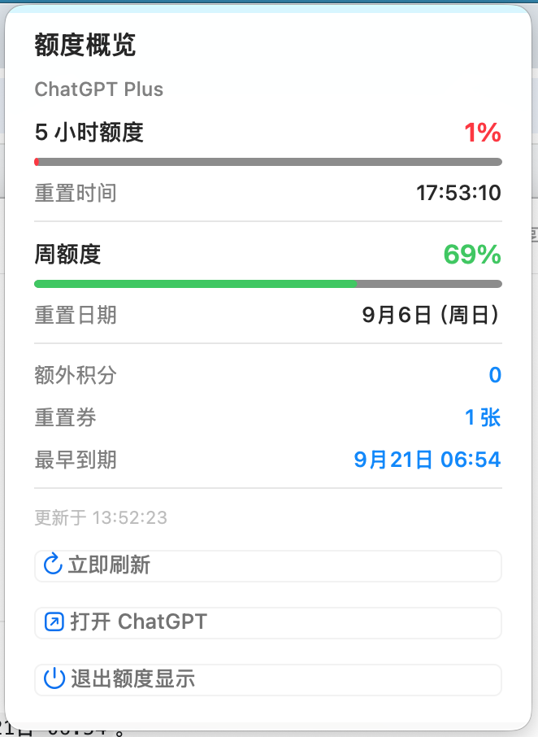
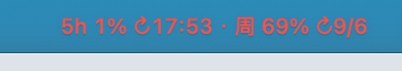

# ChatGPT Quota Bar

一个原生 macOS 菜单栏工具，读取本机 ChatGPT/Codex 桌面客户端提供的只读额度快照。

菜单栏会显示类似：`5h 65% ↻12:50 · 周 94% ↻9/6`。

- 5 小时窗口显示剩余百分比与重置时分
- 周窗口显示剩余百分比与重置月/日
- 每分钟刷新，并在 ChatGPT 启动时刷新
- 低于 30% 显示橙色；低于 15% 显示红色
- 下拉菜单显示完整重置时间、积分与重置券
- 不读取浏览器 Cookie，不保存账号令牌

## 界面预览

卡片式下拉菜单会同时显示两个额度窗口、进度条、重置时间、积分和重置券到期时间：



菜单栏会保留紧凑的实时摘要，低额度时自动变为橙色或红色：



## 安装

### 普通使用者

1. 在 [Releases](../../releases) 下载最新的 ZIP 并解压。
2. 双击 `安装.command`。
3. 如果 macOS 阻止首次运行，请右键该文件并选择“打开”。

应用会安装到 `~/Applications/ChatGPT 额度.app`，并在登录后自动启动。双击
`卸载.command` 可以删除应用与登录启动项。

### 从源码构建

要求：macOS 14+、Xcode Command Line Tools，以及已安装并登录的最新版 ChatGPT/Codex 桌面客户端。

```bash
swift test
./scripts/install.sh
```

## 发行包

```bash
./scripts/package-release.sh 1.0.0
```

生成的 ZIP 和 SHA-256 校验文件位于 `dist/`。推送 `v*` 标签会由 GitHub Actions 自动生成同样的 Release 附件。

## 限制与隐私

- 这是 ChatGPT 桌面端的 Codex/Work 额度窗口，不是 OpenAI API 组织账单，也不是普通聊天模型的逐模型消息计数。
- 数据来自本机客户端的只读接口；若客户端更改该内部接口，应用可能暂时无法读取数据。
- 本项目不收集、不传输或保存你的 ChatGPT 凭据、Cookie、聊天内容或额度数据。
- 首个公开版本使用临时签名，尚未使用 Apple Developer ID 公证；从 GitHub 下载后首次启动可能需要在 macOS 中右键选择“打开”。
- 本项目不是 OpenAI 官方产品，也未获 OpenAI 赞助或认可。

## License

[MIT](LICENSE)
